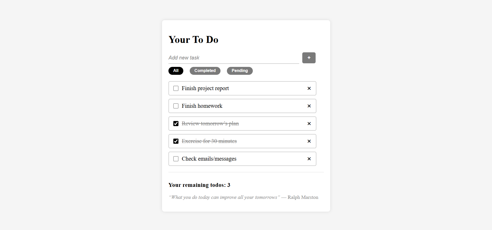
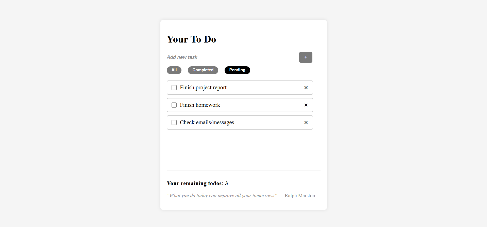

# 📝 React Todo App

A simple and clean **Todo application built with React** that helps users manage daily tasks efficiently.  
The app supports adding, completing, deleting, filtering tasks, and **persists data using localStorage**, so your todos remain even after refreshing the page.

---

## ✨ Features

- ➕ Add new tasks
- ✅ Mark tasks as completed
- ❌ Delete tasks
- 🔍 Filter tasks:
  - All
  - Completed
  - Pending
- 💾 Persistent data storage using `localStorage`

---

## 📸 Screenshots

### Main View


### Completed Tasks Filter


### Pending Tasks Filter


---

## 🛠️ Built With

- **React**
- **JavaScript (ES6+)**
- **CSS**
- **localStorage API**

---

## 🚀 Getting Started

🔗 Live app: https://todolist-upendrakda.netlify.app/

Follow these steps to run the project locally:

### 1. Clone the repository
```bash
git clone https://github.com/upendrakda/To-Do-List.git
```

### 2. Navigate to the project folder
```bash
cd To-Do-List
```

### 3. Install dependencies
```bash
npm install
```

### 4. Start the development server
```bash
npm run dev
```

---

## 📌 Final Notes

This project was built as a learning exercise to practice React fundamentals.  
More features and improvements may be added in the future as learning continues.

Happy coding! 🚀